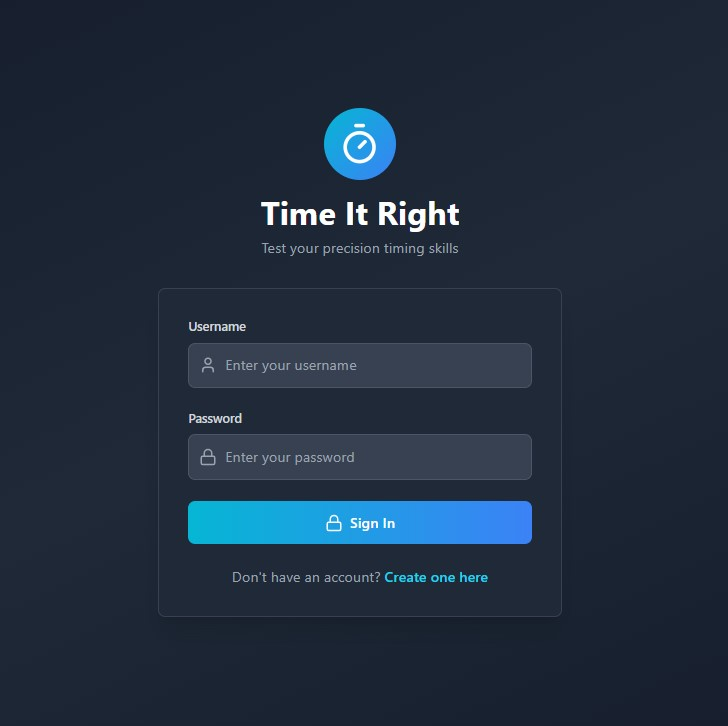
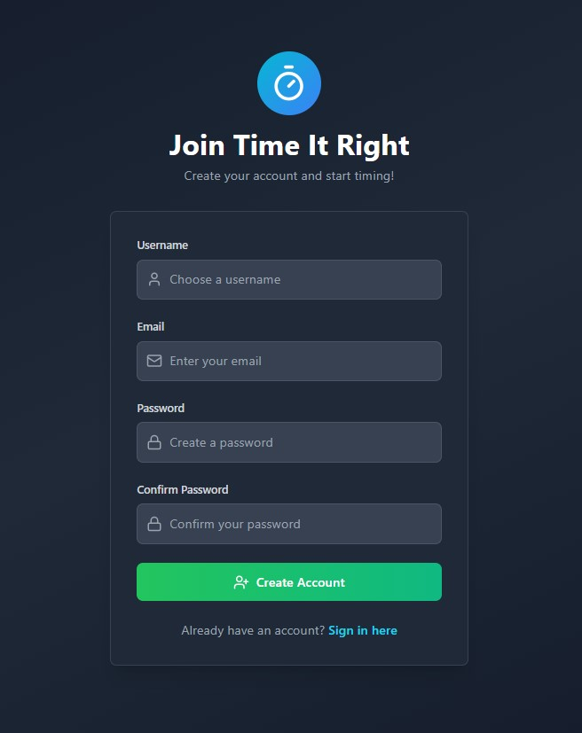
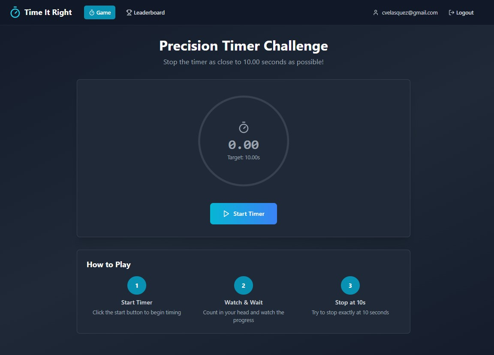
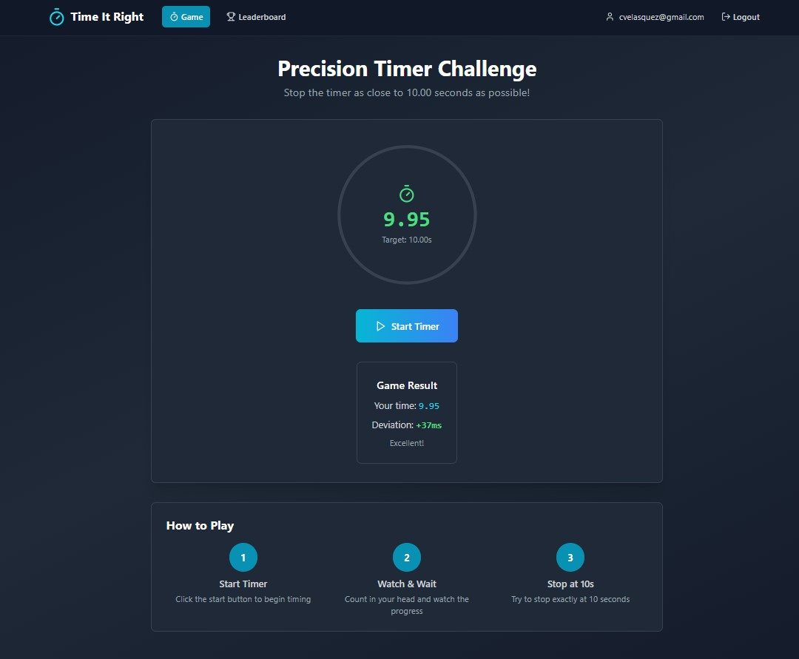
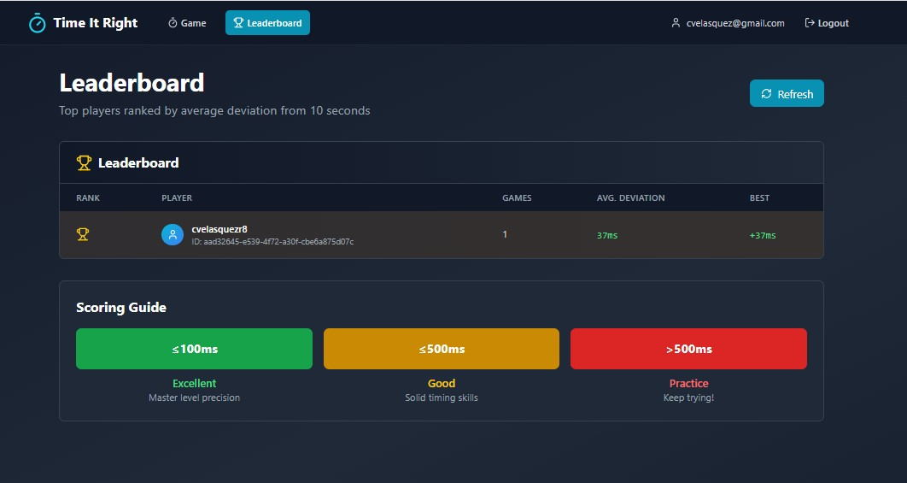

# Time It Right – Handle Repository

This is the handle repository for the Time It Right application. It includes both the frontend and backend as Git submodules, allowing unified development and deployment using Docker Compose.

---

## 📦 Repository Structure

```
time-it-right-handle/
│
├── backend/        # Backend API (Node.js, Express, PostgreSQL, TypeScript)
├── frontend/       # Frontend app (React, Vite, Tailwind CSS)
└── docker-compose.yml
```

```
backend/
├── postgres/               # PostgreSQL docker setup
├── src/
│ ├── config/               # App configuration and environment setup
│ ├── controllers/          # HTTP request handlers
│ ├── data/                 # Static seed or mock data
│ ├── dtos/                 # Data Transfer Objects for validation and typing
│ ├── mappers/              # Logic for transforming models/data
│ ├── middlewares/          # Express middlewares (auth, error handling, etc.)
│ ├── models/               # Database models (Sequelize)
│ ├── routes/               # Express route definitions
│ ├── services/             # Business logic and service layer
│ ├── tests/                # Unit and integration tests
│ ├── app.ts                # Express app instance
│ └── server.ts             # Server bootstrap file
├── .dockerignore
├── .env.template           # Environment variable template
├── docker-compose.yml      # Docker services definition
├── Dockerfile              # Backend container definition
├── jest.config.js          # Jest configuration for testing
├── nodemon.json            # Development config for auto-reloading
├── package.json
├── tsconfig.json           # TypeScript compiler options
├── yarn.lock / package-lock.json
```

```
frontend/
├── src/
│ ├── components/           # Reusable UI components
│ ├── context/              # React context providers (e.g., AuthContext)
│ ├── pages/                # Page-level components for routes
│ ├── routes/               # Route definitions
│ ├── services/             # HTTP client services (e.g., API calls)
│ ├── App.tsx               # Root application component
│ ├── index.css             # Global styles
│ ├── main.tsx              # Entry point rendering the React app
│ └── vite-env.d.ts         # Type definitions for Vite
├── .dockerignore
├── .env.example            # Environment variable template
├── .gitignore
├── Dockerfile              # Frontend container definition
├── eslint.config.js        # Linter configuration
├── index.html              # HTML template used by Vite
├── package.json
├── tsconfig.json           # TypeScript configuration
├── vite.config.ts          # Vite configuration
```

---

## 🚀 Quick Start (Local Development)

### 1. Clone the repository including submodules

```
git clone --recurse-submodules https://github.com/cvelasquezr8/time-it-right-handle.git
cd time-it-right-handle
```

If you already cloned without submodules:

```
git submodule update --init --recursive
```

---

---

### 2. Create the .env file in the root

Create a .env file in the root of the repository with the following content:

```
# Backend
PORT=3000
DATABASE_NAME=gameDB
DATABASE_USERNAME=postgres
DATABASE_PASSWORD=postgres
DATABASE_HOST=postgres-db
DATABASE_PORT=5432
JWT_SECRET=MySecretKey
CORS_URL=http://localhost:5174,http://localhost:3000

# Frontend
VITE_API_URL=http://localhost:3000
```

---

---

### 3. Start the application using Docker Compose

```
docker-compose up --build
```

This will:

-   Build and start the PostgreSQL database
-   Build and start the Backend API
-   Build and serve the Frontend with nginx on port 5174

🧪 Accessing the App

-   Frontend (React app): http://localhost:5174
-   Backend (API): http://localhost:3000

---

---

### 📄 Access Swagger API Docs

Once the server is running, the API documentation will be available at:

```
http://localhost:3000/api/docs
```

---

---

### 🐳 Notes

-   The database is initialized with the values from .env.
-   If you need to reset the database, you can run:

```
docker-compose down -v
```

Then:

```
docker-compose up --build
```

---

---

### 👨‍💻 Technologies Used

-   Frontend: React, Vite, Tailwind CSS
-   Backend: Node.js, Express, TypeScript, Sequelize, JWT
-   Database: PostgreSQL
-   Containerization: Docker, Docker Compose
-   Other: Nginx for static frontend hosting

---

### 📂 Related Repositories

---

-   time-it-right-frontend: https://github.com/cvelasquezr8/time-it-right-frontend
-   time-it-right-backend: https://github.com/cvelasquezr8/time-it-right-backend

---

---

### Preview

#### Login:



#### Register:



#### Game:




#### Leaderboard:



---
